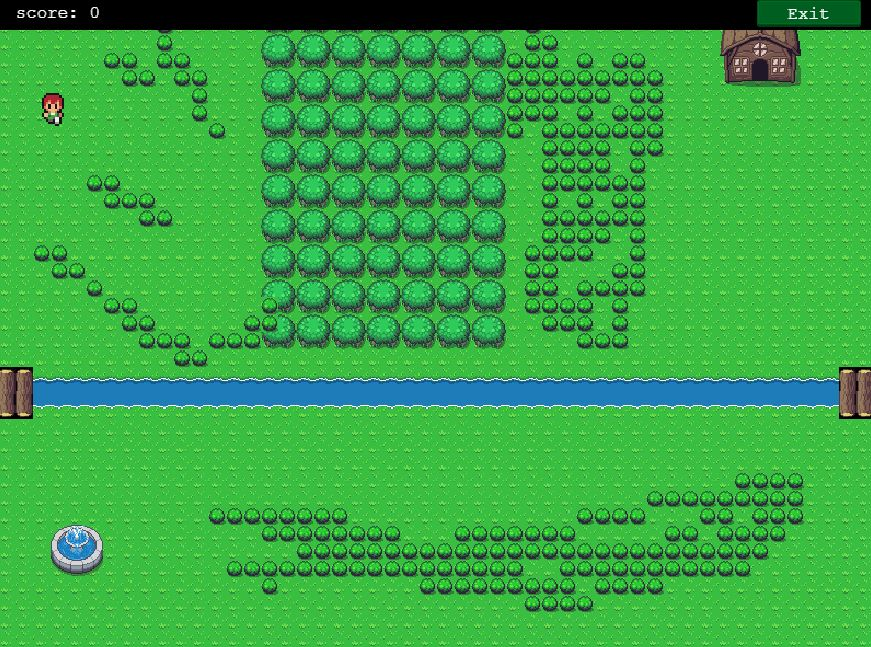

# Zilda - RPG Game

An RPG game built using the Phaser 3 Framework for the JavaScript capstone project.

## Built With

- JavaScript
- Phaser 3
- Webpack

## Live Demo

[Live demo](https://zilton7.github.io/zilda-rpg/)

## Game Instructions

Start the game by clicking on 'Play' button,
also you can change 'Options', check 'HighScore' table
or view 'credits'.
Move your player using the arrow keys on your keyboard.
When in battle, use arrow keys to choose and space bar to confirm your characters attack and
try to defeat the enemies.

## Screenshot



## Setup

To clone this repository run:

```
git clone https://github.com/MarkoNS1990/rpg_game
```

To install the dependencies run:

```
npm install
```

To run the game:

```
npm run start
```

The browser window should popup with the game pre-loading.

## Testing

Run tests with the following command:

```
npm test
```

## AUTHOR

👤 **Marko Zecevic**

[](https://github.com/MarkoNS1990)
[](https://www.linkedin.com/in/zecevicmarko/)

## Show your support

Give a ⭐️ if you like this project!

## Acknowledgments

- Microverse
- Zil Norvils [](https://github.com/zilton7)
- Alex Ramazzoti[](https://github.com/rammazzoti2000)
